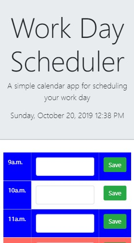

# work-day-planner

**Motivation**

This is a day planner that allows for a user to save their schedule by the hour based on a 9-5 work day. In addition, the planner is color code based on the time of day. So, events in the past are blue, the current hour is red, and events in the future are colored green. Events that the user saved are stored to local storage and can be overwritten whenever the user wants.

**Build status**

The application is not totally finished. I wasn't able to figure out how to display the saved events in the input field after a user refreshes their browser. Also, there were issues with the css style sheet not properly linking with the HTML document. In the end, I added a style section directly o the HTML document.

**Code style**
The application is written in JavaScript using the jQuery library for accessing the DOM api.

**Screenshots**

Here are screenshots of the application.

_Desktop version_


_Mobile version_



**Code Example**

```javascript
//This function takes in and displays the local date and time in real-time using moment.js
function realTime() {
  var dateTime = moment().format("LLLL");
  console.log(dateTime);
  $("#currentDay").append(dateTime);
}
realTime();
console.log(realTime);

//Global variable for parsing userArray from local storage into an array of accesible objects
var storageVariable = localStorage.getItem("userArray");
storageVariable = JSON.parse(storageVariable);

if (!storageVariable) {
  storageVariable = [];
}

//Variable for the current hour in military time
var currentTime = moment().format("H");
console.log(currentTime);
```

**Installation**

No installation necessary. Project is hosted here: https://uchrissd.github.io/work-day-planner/

Welcome to GitHub Pages
